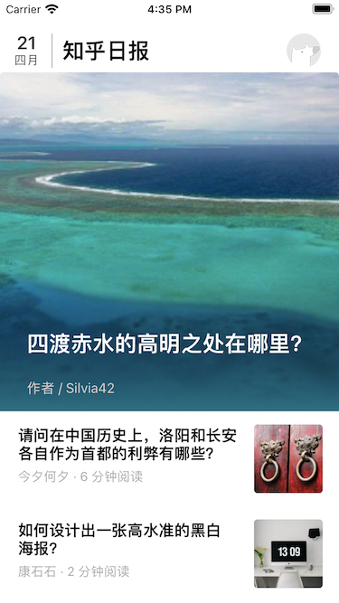
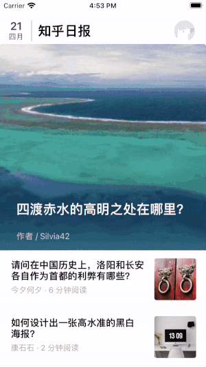
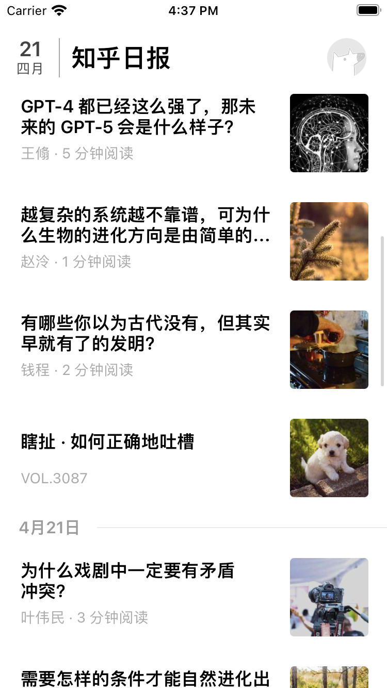
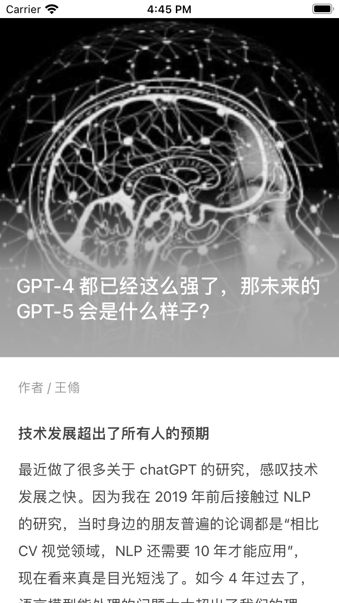

# MVP_ZhihuDaily
MVP 模式实现知乎日报部分功能

**关于用到的MVP 模式写了一篇文章介绍：**

## 功能介绍

此项目为学习MVP 架构模式的Demo，只实现了比较基础的功能，比如首页Banner，新闻列表，点击新闻进入详情页

### 首页

 

#### Banner

使用`UICollectionView`

实现无线轮播，定时功能

 

#### 新闻列表

使用`UITableView`

平平无奇，正常下拉查看过往新闻

 

### 新闻详情页

使用`WKWebView`

点击banner 或者新闻列表进入新闻详情页

 

## 其他技术

- 使用比较基础的`AFNetworking`，`Masonry`框架。

- 封装网络请求工具类`NetworkManager`，包括`GET`, `POST`, `Put`, `Delete` 四个请求的封装

- 给`UIColor`增加处理Hex 的方法，以方便对请求的hex色值作渐变渲染
